# Provena: Digital Investigation Management Platform

Provena centralizes the full lifecycle of a digital investigation in one
traceable workspace: cases and teams, evidence ingestion with SHA-256
integrity, chain of custody, deterministic analysis over verified evidence,
human-reviewed findings, and immutable reporting.

The platform is built around three principles:

- **Integrity before analysis.** Nothing is analyzed until its stored bytes
  are verified against an immutable ingestion baseline.
- **Provenance before conclusions.** Every artifact cites its exact source,
  every correlation cites its contributors, and every finding cites its rule,
  factors, and evidence.
- **Humans decide.** Rules propose, people accept or reject, and only
  accepted findings enter reports.

Provena is not certified forensic software and makes no legal admissibility
claims. Treat it as an investigation management and decision-support tool
with explicit, documented limitations.

## Key capabilities

- Investigation lifecycle management with case numbers, statuses,
  priorities, leads, and team assignment
- Multi-user workspaces with invitation onboarding and four operational roles
- Evidence ingestion with streaming SHA-256 baselines and size limits
- Explicit integrity verification (`verified`, `mismatch`, `unavailable`)
  with persistent per-attempt history
- Append-only chain of custody with holder derivation and transfers
- Deterministic intelligence over verified evidence only
- Structured artifact extraction with exact source locators
- Shared-value cross-evidence correlation with contributor tracing
- Versioned symbolic rules with transparent weighted confidence
- Human review workflows for findings, including bulk triage
- Investigator notes attached to cases or findings
- Immutable content-hashed reports with optional grounded local narrative
- Authorized global search across investigations, evidence, findings, and artifacts
- Append-only audit trail for meaningful operations
- Light and dark themes with a monochrome forensic interface

## AI architecture

Provena answers one question deterministically:

> What structured investigative information exists in verified evidence, and
> where does that information recur across the investigation?

```mermaid
flowchart LR
    V[Verified evidence] --> P[Parsing and normalization]
    P --> X[Artifact extraction]
    X --> C[Shared-value correlation]
    C --> R[Symbolic rule evaluation]
    R --> S[Weighted confidence scoring]
    S --> H[Human validation]
    H --> D[Deterministic report]
    H --> L[Optional Ollama narrative]
    style L fill:#1e293b,stroke:#475569,stroke-dasharray: 5 5
```



Dashed steps are optional. Everything else runs locally with no model.

### Deterministic extraction and normalization

Supported formats are selected by filename extension: `txt`, `log`, `csv`,
`json`, and machine-readable `pdf` through the maintained local `pypdf`
library. Other formats remain stored and managed, but analysis reports them
as unsupported rather than pretending to process them.

Fourteen controlled artifact types are extracted:

`IP_ADDRESS`, `EMAIL_ADDRESS`, `USERNAME`, `HOSTNAME`, `DOMAIN`, `FILE_PATH`,
`FILE_NAME`, `HASH`, `USB_DEVICE`, `TIMESTAMP`, `URL`, `PORT`, `MAC_ADDRESS`,
`PROCESS_NAME`

Extraction combines regular expressions with conservative key-aware rules.
Usernames, hostnames, and device identifiers come from explicit `key=value`
semantics, structured CSV or JSON field names, email local parts, or narrow
workstation-style patterns. Arbitrary tokens are never classified as people,
hosts, or devices. False negatives are preferred over false positives.

Normalization is type-specific and conservative: case folding for usernames,
hostnames, emails, and domains; canonical `ipaddress` forms; scheme and host
lowercasing for URLs; lowercase hexadecimal hashes; ISO-8601 UTC timestamps;
validated ports and MAC addresses. Paths and filenames are stripped but not
rewritten, preserving platform semantics. Values that fail validation are
skipped, never persisted as junk.

### Evidence correlation

A shared-value correlation exists when the same normalized entity appears in
two or more distinct evidence items in one investigation. Correlations are
deterministic, investigation-scoped, and rebuilt on each completed run from
the canonical artifact store. Timestamps are excluded from correlation
because identical clock readings across independent logs are usually
coincidence; they remain first-class artifacts for rules and display.

Every correlation links to its contributing artifacts, and every artifact
links to its evidence and structured source locator:

- TXT and LOG: `{"kind": "line", "line": 37}`
- CSV: `{"kind": "csv", "row": 18, "column": "username"}`
- JSON: `{"kind": "json", "path": "$.events[4].username"}`
- PDF: `{"kind": "pdf", "page": 4}` plus line and character span where known

Artifacts also keep a bounded context excerpt (at most 280 characters).
Storage keys and file contents never appear in API responses or audit logs.

Re-running analysis never duplicates artifacts. Identity is enforced by a
uniqueness constraint over evidence, type, normalized value, locator, and
extractor name and version.

### Symbolic reasoning and confidence

Three versioned rules encode investigator domain knowledge:

| Rule ID | Proposes | Severity |
| --- | --- | --- |
| `identity-recurrence` | A username recurs across three or more evidence items | Low |
| `removable-media-session` | A user, USB device, and shared host link one device and host | Medium |
| `external-transfer-sequence` | File access followed within 24 hours by an external upload sharing a user or host | High |

Confidence is a deterministic weighted sum capped at 100. For example, the
transfer rule combines a shared link (25), file reference (15), temporal
order within 24 hours (20), a verified-evidence factor (10), and a 10-point
base. Factors and weights are stored on every finding and shown in the Why
view. These scores rank and prioritize; they are **not** Bayesian or
otherwise calibrated probabilities.

Recommendations come only from matched rules, for example reviewing custody,
inspecting related file-access evidence, verifying whether a destination is
authorized, or validating details with an account owner. The system never
claims guilt, intent, suspicion scores, or certainty.

### Human validation

Findings start as `pending_review` and can only become `accepted` or
`rejected` through recorded human review with reviewer, timestamp, and
optional note. Regeneration refreshes pending proposals but never overwrites
a human decision. Bulk accept and reject is available with a shared note,
and every affected finding keeps its own reviewer, timestamp, and audit
trail. Analysts may generate and inspect findings; final validation is
reserved for investigation managers and workspace administrators.

## System architecture

Provena is a modular monolith: a React single-page application, one FastAPI
application containing all domain and analysis logic, and PostgreSQL. There
are no queues, background workers, vector stores, or separate AI services.
Analysis runs execute synchronously inside the request with per-evidence
savepoints, so one malformed file produces an explicit failed outcome rather
than corrupting a run.

```mermaid
flowchart TB
    Users --> SPA["React + TypeScript SPA"]
    SPA -->|"HTTP /api/*"| API["FastAPI modular monolith"]
    API --> Auth["Auth / Workspaces / Users"]
    API --> Inv["Investigations + Membership"]
    API --> Ev["Evidence + Integrity + Custody"]
    API --> Intel["Intelligence: runs, artifacts, correlations"]
    Intel --> Find["Rule findings + Validation"]
    Intel --> Rep["Grounded immutable reports"]
    API --> Search["Authorized global search"]
    API --> Audit["Append-only audit log"]
    API --> AI["In-process deterministic engine"]
    AI --> LLM["Optional Ollama narrative"]
    API --> PG[("PostgreSQL")]
    style LLM fill:#1e293b,stroke:#475569,stroke-dasharray: 5 5
```



### Domain services

| Area | Responsibility |
| --- | --- |
| Auth | Self-service registration, username or email login, JWT bearer sessions, logout, current user |
| Workspaces | Workspace creation and selection, membership roles, hashed expiring reusable invites, member management |
| Users | Account roster, admin creation, activation control with self and last-admin guards |
| Investigations | Case numbers (`PRV-YYYY-NNNN`), statuses, priorities, leads, teams, lifecycle rules |
| Evidence | Multipart upload, SHA-256 baselines, verification history, custody, timelines, authenticated download |
| Intelligence | Verified-only runs, artifacts, correlations, findings, notes, grounded reports |
| Search | Scoped multi-entity search across investigations, evidence, findings, and artifacts |
| Dashboard | Scoped counts, attention items, recent investigations, and recent activity |
| Audit | Append-only events for logins, membership, evidence, custody, analysis, findings, notes, and reports |

### Authentication and authorization boundaries

- JWT bearer access tokens with 8-hour lifetime; bcrypt password hashes never
  leave the server; the browser stores the token in `localStorage`, which page
  JavaScript can read. Prefer `httpOnly` cookies if this design is ever
  deployed beyond local trusted use.
- `Workspace` is the authorization boundary. Investigation access first
  verifies the active workspace, then applies workspace-admin or
  investigation-team rules. Unknown and inaccessible investigations both
  return 404 so membership cannot be probed.
- Four workspace roles: `admin`, `investigator`, `forensic_analyst`, and
  `evidence_custodian`. There is no platform-wide super-administrator:
  workspace administrators cannot inspect other workspaces.
- Analysis initiation is limited to workspace admins, managing investigators,
  and assigned analysts. Custodians cannot start analysis. Final finding
  validation and report generation are reserved for managers. Archived
  investigations are read-only except for admins.

## Technology stack

| Layer | Declared dependencies |
| --- | --- |
| Frontend | React 19, TypeScript ~6.0, Vite 8, Tailwind CSS v4, React Router 7, Lucide icons, Vitest 5 with Testing Library and jsdom |
| Backend | Python 3.13, FastAPI 0.115-0.117, Pydantic v2, SQLAlchemy 2.0, Uvicorn 0.30-0.35, `pypdf` 5-7, `python-multipart`, `bcrypt`, `PyJWT`, `httpx`, `psycopg2-binary`, Alembic, pytest |
| Database | PostgreSQL 16 through Docker Compose |
| Local AI | Optional Ollama HTTP API only; no Ollama, OpenAI, Anthropic, LangChain, spaCy, embedding, vector, graph, RAG, or MCP dependencies |
| Development | Docker and Docker Compose, Node 22, PowerShell helper scripts, ESLint, GitHub Actions on pinned `ubuntu-24.04` |

## Investigation workflow

1. Register an account, then create a workspace or join one with an invite code.
2. Create an investigation (`PRV-YYYY-NNNN`) and assign the team and lead.
3. Register evidence files; Provena stores them under generated keys and
   records immutable SHA-256 baselines.
4. Verify integrity explicitly; each attempt records expected and observed
   digests with performer and timestamp.
5. Maintain chain of custody; the current holder derives from append-only
   transfer history.
6. Open AI Analysis, review eligibility, select verified evidence, and run
   deterministic extraction and correlation.
7. Inspect artifacts with exact provenance and shared-value correlations with
   contributor evidence.
8. Evaluate versioned rules; open each finding's Why view for conditions,
   confidence factors, artifacts, correlations, evidence, and
   recommendations.
9. Accept or reject findings individually or in bulk with an optional note;
   attach investigator notes to cases or findings.
10. Generate an immutable content-hashed report from accepted findings only;
    optionally enhance prose through grounded local narrative, then review,
    close, or archive the case.
11. Every meaningful action leaves an append-only audit trail viewable per
    investigation.

## Security, integrity, and traceability

- SHA-256 is the only integrity hash; MD5 and SHA-1 are never used.
- Baselines, uploaders, and registration timestamps are immutable. There is
  no replace-file operation.
- Verification states are explicit: `verified`, `mismatch`, `unavailable`,
  and `not_verified`. Mismatches are flagged, never auto-repaired.
- Only verified evidence enters analysis; all other states produce explicit
  blocked run outcomes with reasons.
- Evidence files are never executed, evaluated, imported, or traversed by
  path. Parsers apply byte, depth, page, leaf, and line-length limits.
- API responses never expose storage keys or paths; downloads use
  `application/octet-stream` with the original filename as metadata.
- Custody and audit records are append-only with no update or delete
  endpoints. Notes support author or admin edits with audit events.
- Reports snapshot accepted findings, evidence, custody, timeline, notes,
  narrative, and generation metadata with a SHA-256 content hash. Rejected
  and pending findings never appear as validated conclusions.

## Getting started

Prerequisites: Python 3.13+, Node 22+, Docker and Docker Compose. Everything
runs locally with no paid services.

```powershell
./scripts/dev.ps1 setup    # database, virtualenv, dependencies, migrations, user seed
./scripts/dev.ps1 demo     # optional deterministic synthetic investigations
./scripts/dev.ps1 api      # backend on :8000 (separate terminal)
./scripts/dev.ps1 web      # frontend on :5173 (separate terminal)
```

Manual equivalents live in `docs/development.md`. Health check:

```text
GET http://localhost:8000/api/health
```

Full-container alternative:

```powershell
docker compose up --build
```

PostgreSQL is published on host port `5433` (container `5432`). Apply schema
changes only through Alembic from `backend/`:

```powershell
python -m alembic upgrade head
```

Provider health for optional narrative generation:

```text
GET http://localhost:8000/api/ai/provider-health
```

### Optional Ollama narrative

Core operation and reporting never require Ollama. To enable local narrative
enhancement with an installed model (for example `qwen3:4b`):

```powershell
ollama pull qwen3:4b
$env:LLM_ENABLED="true"
$env:LLM_PROVIDER="ollama"
$env:OLLAMA_BASE_URL="http://127.0.0.1:11434"
$env:OLLAMA_MODEL="qwen3:4b"
./scripts/dev.ps1 api
```

Grounding safeguards:

- Only accepted findings, confidence factors, recommendations, notes, and
  case metadata enter the prompt. Raw evidence bytes are never sent.
- The provider must return the exact required JSON shape with the exact
  accepted finding IDs.
- Concrete IPs, emails, URLs, filenames, hosts, and quantities are checked
  against supplied context.
- HTTP errors, timeouts, malformed JSON, missing fields, unsupported IDs, or
  ungrounded literals fall back to deterministic prose.
- Provider, model, timestamp, context hash, template version, fallback status,
  and bounded error text are stored in the immutable report snapshot.
- Chain-of-thought output is neither requested nor stored.

## Demo environment

`python -m app.seed_demo` (from `backend/`, after `python -m app.seed`)
builds five deterministic synthetic investigations through real application
services: exfiltration, privileged access, phishing, removable media, and a
closed historical case. Coverage includes verified, awaiting-verification,
and mismatch evidence; real analysis runs; artifacts and correlations; mixed
finding review states; custody activity; notes; and an offline deterministic
report. Reruns add only missing demo state and never duplicate records. The
seed refuses production (`APP_ENV=production`) and never calls Ollama.

Local development accounts (development only, never production credentials):

| Username | Role |
| --- | --- |
| `admin` | Admin |
| `investigator` | Investigator |
| `analyst` | Forensic Analyst |
| `custodian` | Evidence Custodian |

Default password: `provena-dev`, overridable with `SEED_DEV_PASSWORD`. All
four belong to the `Provena Demo Workspace`.

Synthetic scenario inputs live in `sample-data/`, including a deterministic
stdlib PDF generator (`make_access_report.py`). Only synthetic,
non-sensitive data may be committed there; real evidence must never enter
the repository.

## Testing and quality

```powershell
python -m pytest                     # from backend/
npm run lint                         # from frontend/
npm run typecheck                    # from frontend/
npm test                             # from frontend/
npm run build                         # from frontend/
```

Backend tests use throwaway SQLite databases; Alembic remains the only
PostgreSQL schema strategy. Frontend behavior tests use Vitest with Testing
Library. CI runs backend tests plus frontend lint, tests, and build on every
push and pull request. CI does not run the optional Ollama integration
because it requires a local model server.

## Repository structure

```text
provena/
├── frontend/
│   ├── src/
│   │   ├── api/            # typed API client
│   │   ├── auth/           # authentication state
│   │   ├── components/     # design primitives, shell, search, dialogs, toasts
│   │   ├── lib/            # formatting, errors, activity labels, report helpers
│   │   ├── pages/          # dashboard, investigations, evidence, analysis,
│   │   │                   # findings, reports, users, workspaces, auth
│   │   └── theme/          # light/dark theme state
│   └── public/brand/       # approved monochrome identity and production copies
├── backend/
│   ├── app/
│   │   ├── api/            # /api router, health, provider health
│   │   ├── core/           # environment configuration and security helpers
│   │   ├── db/             # engine, session, declarative base
│   │   ├── modules/
│   │   │   ├── auth/       # registration, login, sessions, RBAC helpers
│   │   │   ├── users/      # accounts and admin management
│   │   │   ├── workspaces/ # workspaces, membership, invites
│   │   │   ├── investigations/
│   │   │   ├── evidence/   # storage abstraction, verification, custody
│   │   │   ├── intelligence/ # runs, artifacts, correlations, findings,
│   │   │   │                 # notes, reports, grounded narrative
│   │   │   ├── search/     # authorized multi-entity search
│   │   │   ├── dashboard/  # scoped counts and attention data
│   │   │   └── audit/      # append-only application events
│   │   └── ai/             # pure parsers, extractors, normalization,
│   │                       # correlation, and rules (no web or ORM imports)
│   └── alembic/versions/   # ordered PostgreSQL migrations
├── sample-data/            # deterministic synthetic fixtures and PDF generator
├── scripts/                # dev.ps1 workflow and acceptance E2E script
├── docs/                   # architecture, AI, evidence, development guides
├── .github/workflows/ci.yml
├── .env.example
├── AGENTS.md
└── docker-compose.yml
```

## Documentation index

- `docs/architecture.md`: modular monolith, workspaces, RBAC, domains, APIs, diagrams
- `docs/ai-architecture.md`: deterministic pipeline, rules, confidence, validation, Ollama grounding
- `docs/evidence-integrity.md`: baselines, verification, custody, provenance, analysis eligibility
- `docs/development.md`: setup, environment, migrations, seeds, tests, troubleshooting, Ollama
- `sample-data/README.md`: synthetic-data rules and scenario inventory
- `AGENTS.md`: repository conventions for coding agents

## Limitations and future directions

Implemented and supported: deterministic extraction over verified txt, log,
csv, json, and machine-readable PDF; shared-value correlation; three
versioned rules; weighted ranking confidence; human validation; deterministic
and optionally narrated immutable reports; workspace RBAC; audit coverage;
print-to-PDF through the browser.

Not implemented: Bayesian confidence scoring, knowledge graphs, cross-case
machine learning, embeddings, vector search, OCR and deep binary forensics,
RAG, MCP, microservices, queues, or cloud infrastructure.

No benchmark, certification, forensic-admissibility, security, or
availability guarantees are made. Validate behavior in your own environment
before relying on Provena operationally.
