# Provena: Digital Investigation Management Platform

Provena is an AI-assisted digital investigation management platform. It
centralizes the lifecycle of a digital investigation (cases, evidence, chain of
custody, explainable analysis, human validation, reporting) while preserving
evidence integrity, traceability, and human oversight.

This is a two-person university project (Software Engineering + AI). It is
**not** certified forensic software and must never be described as such.

## The problem Provena solves

Digital investigations scatter across spreadsheets, shared drives, chat logs,
and analysts' memories. Ownership is unclear, evidence handling is hard to
reconstruct, and analytical reasoning is rarely recorded. Provena gives small
investigative teams one place where cases, team responsibilities, evidence
handling, and the reasoning behind conclusions are all explicit and auditable.

## Core platform concept

Every investigation moves through a managed lifecycle with an assigned team,
and everything that happens (status changes, team changes, and later evidence
handling and analysis) leaves an audit trail. AI assistance is built on top of
that traceable foundation: deterministic, explainable analysis first, with
human investigators validating findings before anything reaches a report.

## Current implementation status

Working end-to-end slice: **self-service accounts, workspaces, invitation-based
membership and roles, investigation management with team membership, forensic evidence with SHA-256 integrity and
chain of custody, deterministic intelligence (extraction plus shared-value
correlation over verified evidence), rule-based findings with human
validation, grounded local narrative generation with deterministic fallback,
immutable reporting, audit logging, timelines, and a polished web UI**.

### Implemented now

- Username/email login with bcrypt-hashed passwords and JWT bearer sessions
- Self-service registration followed by create-workspace or invite-code onboarding
- Workspace isolation for investigations, evidence, findings, search, and member rosters
- Hashed, expiring, reusable invitation codes with role assignment
- Four workspace-scoped roles with backend-enforced authorization: admin, investigator,
  forensic analyst, evidence custodian
- Explicit dev seed creating one login per role (`python -m app.seed`)
- Investigations with auto-generated case numbers (`PRV-2026-0001`), statuses,
  priorities, lead investigator, and multi-user teams
- Lifecycle rules: close sets `closed_at`, reopen clears it, archived work is
  read-only for non-admins
- Append-only audit log with per-investigation history in the UI
- Evidence registration with multipart upload and server-side SHA-256 baselines
- Explicit integrity verification (`verified`, `mismatch`, `unavailable`)
  with persistent verification history
- Append-only chain of custody with transfers and current-holder tracking
- Evidence, investigation, and custody timelines assembled from real records
- Local evidence storage outside the repo, configurable size limits
- Dashboard, investigation workspace (Overview, Evidence, AI Analysis,
  Timeline, Custody, Reports, Audit Log), evidence detail with
  integrity/custody sections, admin user management
- Verified-only analysis runs over txt, log, csv, json, and machine-readable
  PDF; 14 artifact types with provenance locators; shared-value correlations
- Three versioned rules proposing findings with weighted confidence factors;
  pending/accepted/rejected validation with reviewer and note
- Investigator notes on cases and findings; deterministic reports from
  accepted findings with content hashes and print-to-PDF
- Optional Ollama-compatible report narrative over accepted structured facts,
  with validated JSON output, generation metadata, and deterministic fallback
- Light/dark/system themes, approved monochrome brand, global search,
  dialogs, toasts, skeletons, and empty/error states throughout
- PostgreSQL persistence via Alembic migrations; backend pytest suite,
  frontend vitest behavior tests

### Future enhancements

- Bayesian confidence scoring (current scoring is deterministic and weighted)
- Knowledge graphs, cross-case analysis, automated timeline reconstruction
- OCR and deep binary forensics

## AI architecture overview

**The LLM is not the investigative reasoning engine.** Provena separates
explainable analytical AI (deterministic parsing, extraction, correlation,
symbolic rule-based reasoning, transparent weighted scoring) from generative
AI. An optional local LLM via Ollama renders *already-validated* structured
findings into report prose, and the system stays useful when it is unavailable.
Initial scoring is deterministic and weighted; Bayesian scoring
is a future enhancement, not a current claim. Full design and course mapping
in `docs/ai-architecture.md`.

## Technology stack

| Layer    | Choice                                                        |
| -------- | ------------------------------------------------------------- |
| Frontend | React 19, TypeScript, Vite, Tailwind CSS v4, React Router, Lucide icons, Vitest |
| Backend  | Python 3.13, FastAPI, Pydantic v2, SQLAlchemy 2.0            |
| Database | PostgreSQL 16 (Docker Compose for local dev)                  |
| Auth     | bcrypt passwords, PyJWT bearer tokens                         |
| Analysis | Deterministic parsers, regex, key-aware rules, pypdf, custom correlation |
| Dev      | Docker/Docker Compose, pytest, ESLint, Alembic                 |

The backend is a **modular monolith**: all domain and analysis logic lives in
one FastAPI application (`backend/app/modules/`, `backend/app/ai/`). Workspace
membership is the authorization boundary, while investigation teams are
workspace-member subsets.
See `docs/architecture.md`.

## System architecture

```mermaid
flowchart TB
    Users --> SPA["React + TypeScript SPA"]
    SPA -->|"HTTP /api/*"| API["FastAPI modular monolith"]
    API --> Auth["Auth / Workspaces / Users"]
    API --> Inv["Investigations + Membership (implemented)"]
    API --> Ev["Evidence + Integrity + Custody (implemented)"]
    API --> Intel["Intelligence: runs, artifacts, correlations (implemented)"]
    Intel --> Find["Rule findings + Validation (implemented)"]
    Intel --> Rep["Immutable grounded reports"]
    API --> Audit["Audit log (implemented)"]
    API --> AI["AI investigation engine, in-process (partially implemented)"]
    AI --> LLM["Optional Ollama report prose"]
    API --> PG[("PostgreSQL")]
    style LLM fill:#1e293b,stroke:#475569,stroke-dasharray: 5 5
```



## Investigation workflow (product vision)


Every step shown is implemented. Analysis uses deterministic extraction,
correlation, and versioned rules. Reports include only accepted findings as
validated conclusions.

## Repository structure

```text
provena/
├── frontend/        # React SPA: themed shell, dashboard, investigation workspace
│   └── src/{api,auth,components,lib,pages,theme}/
│   └── public/brand/  # approved monochrome identity + production copies
├── backend/         # FastAPI modular monolith
│   └── app/{api,core,db,modules/{auth,users,investigations,evidence,dashboard,audit},ai}
├── docs/            # architecture.md, ai-architecture.md, development.md, evidence-integrity.md
├── sample-data/     # synthetic exfiltration-scenario logs (fictional, committable)
├── scripts/         # dev.ps1: canonical Windows local-development workflow
├── .github/         # CI workflow (pinned ubuntu-24.04)
├── .env.example     # safe example config (never commit .env)
├── AGENTS.md        # instructions for AI coding agents
└── docker-compose.yml
```

## Interface

The interface follows a restrained forensic visual language (monochrome-first,
true-black dark surfaces, equally designed light theme) with the approved
Provena mark: a geometric P with provenance nodes for lineage and custody.

- Light, dark, and system themes with persistence and no first-paint flash
- Compact shell: brand sidebar, global investigation search, role-gated
  creation, account menu, theme control
- Dashboard with live caseload figures from `GET /api/dashboard/summary`
  (scoped counts, integrity issues, recent activity), never fabricated metrics
- Investigation workspace: Overview, Evidence, Timeline, Custody, AI Analysis,
  Findings, Reports, and Audit Log
- Evidence as a forensic record: baseline digest with copy, verification
  stepper and history, custody flow, timeline, transfers via dialog
- Dialogs, drawers, toasts, skeletons, empty/error states, keyboard support,
  focus management, reduced-motion support, responsive layouts

## Local development

Prerequisites: Python 3.13+, Node 22+, Docker + Docker Compose. Zero budget
required; everything runs locally.

Canonical Windows workflow from the repository root:

```powershell
./scripts/dev.ps1 setup    # db, venv, dependencies, migrations, user seed
./scripts/dev.ps1 demo     # optional synthetic demo investigation
./scripts/dev.ps1 api      # backend on :8000 (new terminal)
./scripts/dev.ps1 web      # frontend on :5173 (new terminal)
```

Full-container alternative: `docker compose up --build` (db :5433,
api :8000, web :5173). See `docs/development.md` for the manual equivalent,
environment variables, and troubleshooting.

Open `http://localhost:5173` and sign in. Health check:
`GET http://localhost:8000/api/health`.

## Database setup

PostgreSQL 16 via Docker, published on **host port 5433** (container 5432),
since many machines already run Postgres on 5432. Schema is managed with
Alembic (`backend/alembic/versions/`); the app never uses `create_all`
outside tests. Verify with `alembic upgrade head` followed by
`alembic downgrade base` and `upgrade head` again on a dev database.

## Authentication and development users

Visitors may register, then create a workspace or join one with an invite code.
Log in with username or email. The user seed (`python -m app.seed` from
`backend/`, idempotent) creates `admin`, `investigator`, `analyst`, and
`custodian` (password `provena-dev` by default, overridable via
`SEED_DEV_PASSWORD`; **local development only**). All four belong to the
`Provena Demo Workspace`. The demo seed
(`python -m app.seed_demo`) builds a populated fictional exfiltration
investigation from `sample-data/` for walkthroughs. Admins can create
further users via `POST /api/users`. Tokens expire after 8 hours; logout
discards the token and records an audit event. An expired session signs
the UI out automatically.

## Testing

```powershell
python -m pytest                     # from backend/ (SQLite-backed)
npm run lint                         # from frontend/
npm run typecheck                    # from frontend/
npm test                             # from frontend/ (vitest behavior tests)
npm run build                         # from frontend/
```

CI (pinned `ubuntu-24.04`) runs backend tests plus frontend lint, tests, and
build on every push/PR. Recent runs #4-6 failed on GitHub-hosted runner
acquisition and an internal server error; those are infrastructure failures,
not Provena failures (see `docs/development.md`).

## Project documentation

- `docs/architecture.md`: system design, auth/RBAC, domain model, diagrams
- `docs/evidence-integrity.md`: ingestion, storage, verification, custody
- `docs/ai-architecture.md`: hybrid AI design, explainability, course mapping
- `docs/development.md`: setup, seed, migrations, ports, troubleshooting
- `AGENTS.md`: conventions for AI coding agents working in this repo

## Academic context

Provena is coursework spanning Software Engineering (modular architecture,
testing, documentation, process) and Artificial Intelligence (knowledge
representation, symbolic reasoning, reasoning under uncertainty, NLP, natural
language generation). The AI documentation distinguishes implemented platform
functionality from planned AI concepts, and the system is designed so every
future AI conclusion traces back to evidence, rules, and recorded confidence.
