# Provena: Digital Investigation Management Platform

Provena is an AI-assisted digital investigation management platform. It
centralizes the lifecycle of a digital investigation (cases, evidence, chain of
custody, explainable analysis, human validation, reporting) while preserving
evidence integrity, traceability, and human oversight.

This is a two-person university project (Software Engineering + AI). It is
**not** certified forensic software and must never be described as such.

## The problem Provena solves

Digital investigations scatter across spreadsheets, shared drives, chat logs,
and analysts' memories. Ownership is unclear, evidence handling is hard to
reconstruct, and analytical reasoning is rarely recorded. Provena gives small
investigative teams one place where cases, team responsibilities, evidence
handling, and the reasoning behind conclusions are all explicit and auditable.

## Core platform concept

Every investigation moves through a managed lifecycle with an assigned team,
and everything that happens (status changes, team changes, and later evidence
handling and analysis) leaves an audit trail. AI assistance is built on top of
that traceable foundation: deterministic, explainable analysis first, with
human investigators validating findings before anything reaches a report.

## Current implementation status

Working end-to-end slice: **authentication, users and roles, investigation
management with team membership, audit logging, and a polished web UI**.
Evidence handling and AI analysis are planned, not implemented.

### Implemented now

- Username/email login with bcrypt-hashed passwords and JWT bearer sessions
- Four roles with backend-enforced authorization: admin, investigator,
  forensic analyst, evidence custodian
- Explicit dev seed creating one login per role (`python -m app.seed`)
- Investigations with auto-generated case numbers (`PRV-2026-0001`), statuses,
  priorities, lead investigator, and multi-user teams
- Lifecycle rules: close sets `closed_at`, reopen clears it, archived work is
  read-only for non-admins
- Append-only audit log with per-investigation history in the UI
- Dashboard, investigation list, creation form, detail view with editing,
  team management, and audit timeline
- PostgreSQL persistence via Alembic migrations; 32 backend tests

### Planned

- Evidence registration, upload, metadata, SHA-256 integrity verification
- Chain of custody
- Investigator findings and notes, investigation timeline
- Explainable AI analysis: extraction, correlation, rule-based reasoning,
  weighted confidence scoring, recommendations
- Investigator validation of AI findings, AI-assisted report generation

## AI architecture overview

**The LLM is not the investigative reasoning engine.** Provena separates
explainable analytical AI (deterministic parsing, extraction, correlation,
symbolic rule-based reasoning, transparent weighted scoring) from generative
AI. A local LLM via Ollama may later render *already-validated* structured
findings into report prose, and the system stays useful when it is
unavailable. Initial scoring is deterministic and weighted; Bayesian scoring
is a future enhancement, not a current claim. Full design and course mapping
in `docs/ai-architecture.md`.

## Technology stack

| Layer    | Choice                                                        |
| -------- | ------------------------------------------------------------- |
| Frontend | React 19, TypeScript, Vite, Tailwind CSS, React Router        |
| Backend  | Python 3.13, FastAPI, Pydantic v2, SQLAlchemy 2.0            |
| Database | PostgreSQL 16 (Docker Compose for local dev)                  |
| Auth     | bcrypt passwords, PyJWT bearer tokens                         |
| Analysis | Planned: deterministic parsers, regex, spaCy, custom rules    |
| Dev      | Docker/Docker Compose, pytest, ESLint, Alembic                 |

The backend is a **modular monolith**: all domain and analysis logic lives in
one FastAPI application (`backend/app/modules/`, `backend/app/ai/`).
See `docs/architecture.md`.

## System architecture

```mermaid
flowchart TB
    Users --> SPA["React + TypeScript SPA"]
    SPA -->|"HTTP /api/*"| API["FastAPI modular monolith"]
    API --> Auth["Auth / Users (implemented)"]
    API --> Inv["Investigations + Membership (implemented)"]
    API --> Audit["Audit log (implemented)"]
    API --> PlannedBE["Evidence, Custody, Findings, Reports (planned)"]
    API --> AI["AI investigation engine, in-process (planned)"]
    API --> PG[("PostgreSQL")]
    style PlannedBE fill:#1e293b,stroke:#475569,stroke-dasharray: 5 5
    style AI fill:#1e293b,stroke:#475569,stroke-dasharray: 5 5
```



## Investigation workflow (product vision)


Create, Assign Team, Validation, and Archive are implemented; the evidence
and analysis stages are planned.

## Repository structure

```text
provena/
├── frontend/        # React SPA: login, shell, dashboard, investigations
│   └── src/{api,auth,components,pages}/
├── backend/         # FastAPI modular monolith
│   └── app/{api,core,db,modules/{auth,users,investigations,audit},ai}
├── docs/            # architecture.md, ai-architecture.md, development.md
├── sample-data/     # synthetic demo data policy (no real evidence, ever)
├── .github/         # CI workflow
├── .env.example     # safe example config (never commit .env)
├── AGENTS.md        # instructions for AI coding agents
└── docker-compose.yml
```

## Local development

Prerequisites: Python 3.13+, Node 22+, Docker + Docker Compose. Zero budget
required; everything runs locally.

```bash
cp .env.example .env
docker compose up --build     # db :5433, api :8000, web :5173
```

With the database up, migrate and seed (from `backend/`):

```bash
alembic upgrade head
python -m app.seed
```

Or run services from source (see `docs/development.md` for details):

```bash
pip install -r backend/requirements.txt
uvicorn app.main:app --reload          # from backend/
npm install && npm run dev             # from frontend/
```

Open `http://localhost:5173` and log in. Health check:
`GET http://localhost:8000/api/health`.

## Database setup

PostgreSQL 16 via Docker, published on **host port 5433** (container 5432),
since many machines already run Postgres on 5432. Schema is managed with
Alembic (`backend/alembic/versions/`); the app never uses `create_all`
outside tests. Verify with `alembic upgrade head` followed by
`alembic downgrade base` and `upgrade head` again on a dev database.

## Authentication and development users

Log in with username or email. The seed (`python -m app.seed`, idempotent)
creates `admin`, `investigator`, `analyst`, and `custodian` (password
`provena-dev` by default, overridable via `SEED_DEV_PASSWORD`;
**local development only**). Admins can create further users via
`POST /api/users`. Tokens expire after 8 hours; logout discards the token
and records an audit event.

## Testing

```bash
python -m pytest                     # from backend/ (32 tests, SQLite-backed)
npm run lint && npm run typecheck    # from frontend/
npm run build                         # from frontend/
```

CI runs backend tests plus frontend lint and build on every push/PR.

## Project documentation

- `docs/architecture.md`: system design, auth/RBAC, domain model, diagrams
- `docs/ai-architecture.md`: hybrid AI design, explainability, course mapping
- `docs/development.md`: setup, seed, migrations, ports, troubleshooting
- `AGENTS.md`: conventions for AI coding agents working in this repo

## Academic context

Provena is coursework spanning Software Engineering (modular architecture,
testing, documentation, process) and Artificial Intelligence (knowledge
representation, symbolic reasoning, reasoning under uncertainty, NLP, natural
language generation). The AI documentation distinguishes implemented platform
functionality from planned AI concepts, and the system is designed so every
future AI conclusion traces back to evidence, rules, and recorded confidence.
