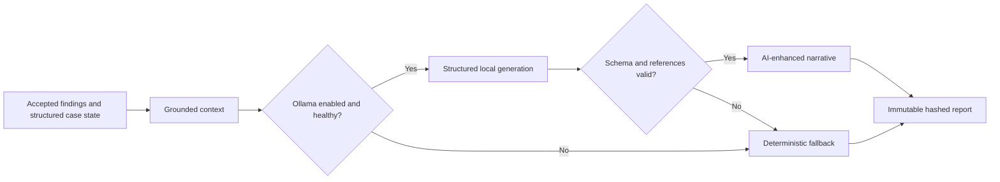
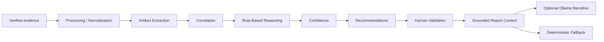

# AI Architecture

> Status: hybrid implementation. **Extraction, correlation, rule-based findings,
> human validation, grounded optional Ollama narrative, and deterministic
> fallback reporting are implemented.**

## Implemented local narrative provider

Report narrative generation uses a small provider boundary in the modular
monolith. The default provider is deterministic and requires no model. When
`LLM_ENABLED=true`, `LLM_PROVIDER=ollama`, and `OLLAMA_MODEL` is configured,
Provena sends only a controlled JSON context to Ollama. That context contains
investigation metadata, accepted findings, confidence factors,
recommendations, and investigator notes. Raw evidence bytes are never sent.

The prompt requires JSON with an executive summary, investigation narrative,
per-finding narratives, a conclusion, and referenced finding IDs. Provena
validates the structure, length limits, and finding IDs. Any HTTP error,
timeout, malformed JSON, missing field, or unsupported finding reference is
rejected and replaced with deterministic prose. Provider, model, generation
time, context SHA-256, template version, fallback flag, and bounded error are
stored in the immutable report snapshot. Hidden chain-of-thought is neither
requested nor stored.

The validator also rejects concrete IP addresses, email addresses, URLs,
filenames, host identifiers, and quantities that do not occur in the supplied
context. This deliberately prefers fallback over fluent but unsupported prose.

The provider does not parse evidence, correlate entities, run rules, set
confidence, change finding status, determine integrity, or update custody.

## The deterministic analytical pipeline

```mermaid
flowchart TB
    Ingest[Evidence Ingestion] --> Proc[Processing / Normalization]
    Proc --> Extract[Artifact & Entity Extraction]
    Extract --> Corr[Evidence Correlation]
    Corr --> Rules[Rule-Based Reasoning]
    Rules --> Score[Confidence Scoring]
    Score --> Rec[Investigation Recommendations]
    Rec --> Human[Human Investigator Validation]
    Human --> Validated[Validated structured findings]
    Validated --> Template[Structured report template]
    Validated --> LLMGen{Ollama / local LLM: prose generation only}
    LLMGen --> Report[Investigation report]
    Template --> Report

    subgraph Explainable["Explainable analytical AI (deterministic, traceable)"]
        Ingest
        Proc
        Extract
        Corr
        Rules
        Score
        Rec
    end
    subgraph Generative["Generative AI (language only)"]
        LLMGen
    end
    style Explainable fill:#0c2a3f,stroke:#0ea5e9
    style Generative fill:#3b2f0c,stroke:#eab308
```

The boundary is deliberate: everything that determines investigative truth
lives in the explainable block; the generative block only turns
already-validated findings into readable prose. Human validation happens
**before** any generative step.

## Evidence foundation (implemented) feeds the pipeline (implemented through validation)

The evidence layer now provides what the intelligence milestones consume:

- stable evidence identifiers (`E-001`) that findings can cite,
- metadata, timestamps, source provenance, and original filenames,
- evidence types (`log`, `network`, ...) for routing to the right parsers,
- integrity state per item, plus controlled content access through the
  storage service (`app/modules/evidence/storage.py`),
- custody history showing how each item was handled.

The implemented order is therefore:

Implemented: verified-only processing, parsers (txt, log, csv, json, pdf),
14 artifact types, provenance locators, deduplicated artifacts, shared-value
correlation, three rules, weighted confidence, recommendations from rules,
pending/accepted/rejected validation, investigator notes, deterministic
reports, optional Ollama narrative enhancement, and deterministic fallback.

One principle governs this handoff: **analysis runs only on VERIFIED
evidence.** A `mismatch`, `unavailable`, or never-verified item is blocked
server-side with an explicit reason, never silently consumed. Verification
status travels with the evidence into processing, and the synthetic logs plus
generated PDF in `sample-data/` exist so extraction work has realistic,
committable input.

## A. Why Provena uses a hybrid AI architecture

Provena combines two different kinds of AI because they solve different
problems:

1. **Deterministic evidence processing and symbolic reasoning** (parsers,
   extraction, correlation, rule engine, weighted scoring, recommendation
   logic) establish *what the evidence supports*. This part must be
   inspectable, reproducible, and auditable.
2. **Generative AI for natural-language reporting** (a local LLM) turns
   validated structured findings into professional report prose. It handles
   *how findings read*, never *what they claim*.

A pure-LLM approach cannot preserve evidence integrity, cite verifiable
derivation steps, or avoid hallucination. A pure-template approach produces
reports investigators find tedious to finalize. The hybrid keeps truth in
deterministic code and delegates only wording to the model.

## B. Why rule-based reasoning counts as AI

Rule-based reasoning is **symbolic AI** in the expert-systems tradition: the
system encodes investigator domain knowledge as explicit rules and applies it
to structured facts to derive new hypotheses and next-step recommendations
(e.g. "IF outbound traffic to an unknown host coincides with USB insertions
on the same workstation within 24h, THEN suggest reviewing DLP alerts for
that host, citing both evidence items"). That is machine reasoning over a
knowledge base, not just form validation. The initial rule set will be small
and transparent; sophistication grows by adding rules and correlations, not by
adding opacity.

## C. Explainability

Every future AI conclusion must be traceable to:

- the supporting evidence items (by id),
- the extracted artifacts and entities,
- the correlations that linked them,
- the triggered rules (by rule id),
- the confidence contributions of each factor,
- the resulting recommendation.

If an investigator asks "why does the system believe this", the answer is a
chain of recorded references, not a generated paragraph. This trace is what
makes the audit log meaningful for analysis events
(`AI_ANALYSIS_STARTED`, `AI_ANALYSIS_COMPLETED`, `AI_ANALYSIS_FAILED`,
`AI_FINDING_GENERATED`, `AI_FINDING_ACCEPTED`, `AI_FINDING_REJECTED`, and
`REPORT_GENERATED`).

## D. Confidence scoring

- **Implemented: transparent weighted confidence scoring.**
  Each contributing factor has a recorded weight, and the final score is a
  documented combination of its inputs. These scores rank and prioritize
  findings; they are **not** mathematically calibrated probabilities and must
  never be presented as such.
- **Future enhancement: Bayesian confidence scoring**, where prior beliefs
  update with observed evidence. This is explicitly not the starting design.

## E. Generative AI / Ollama

- A free, local LLM is optional; **Ollama is the implemented inference mechanism**
  (zero budget, data never leaves the machine).
- Model choice must remain hardware-conscious: small instruction-tuned models
  (a few billion parameters) are sufficient for rephrasing structured input.
- The model receives **validated structured findings**, not massive raw
  evidence dumps. Input size stays small and reviewable.
- The LLM is used for **language generation** and is **not the source of
  investigative truth**.
- Provena **degrades gracefully** when the LLM is unavailable: analysis,
  validation, and structured reports keep working; only the polished prose
  rendering falls back to a simple template.

## F. Human oversight

Investigators remain responsible for validating findings and making
investigative decisions. AI provides decision support: it surfaces patterns,
scores hypotheses, and suggests next steps, but no AI output reaches a report
without recorded human acceptance. Rejected findings are excluded downstream
and remain visible in the audit trail as rejected.

## G. Technical capability mapping

Provena implements these capabilities as deterministic platform behavior:

- **Intelligent agents:** the analysis pipeline perceives evidence and acts by
  recommending investigative steps, with the investigator in the loop.
- **Knowledge representation:** structured evidence, entities, rules, and
  finding records with explicit references.
- **Search and correlation:** deterministic shared-artifact correlation is
  implemented; a future investigation knowledge graph may extend it.
- **Symbolic AI / expert systems:** the rule engine encoding investigator
  domain knowledge.
- **Rule-based reasoning:** deriving hypotheses and recommendations from
  structured facts.
- **Reasoning under uncertainty:** transparent weighted confidence now,
  Bayesian scoring later.
- **Information extraction:** deterministic regex and key-aware structured
  extraction with exact source locators.
- **Planning:** recommendation of next investigative steps given current state.
- **Natural language generation:** optional grounded rendering of accepted
  findings into report prose, with deterministic fallback.

## H. Milestone boundary: what is real and what is next

Implemented (Milestone 4 plus reasoning/reporting): information extraction
(regex plus key-aware structured rules over txt, log, csv, json, and
machine-readable PDF via pypdf), knowledge representation (artifacts with
locators, correlations with contributors, findings with factors), information
retrieval (filtered artifact and correlation APIs), deterministic
shared-value correlation, symbolic rule-based reasoning (three versioned
rules), transparent weighted confidence, rule-derived recommendations, human
validation (pending/accepted/rejected with reviewer and note), and
deterministic reporting from accepted findings.

Explicitly not implemented: Bayesian confidence scoring, knowledge graphs,
automated timeline reconstruction, cross-case pattern analysis, evidence
similarity detection, embeddings, vector search, RAG, and MCP integrations.
Optional Ollama narrative enhancement is implemented with grounding
validation and deterministic fallback; the model never originates findings,
scores, integrity results, or custody facts. The rule set is intentionally
small; sophistication grows by adding inspectable rules, not opacity.

## I. Future AI enhancements

Legitimate possibilities once the foundation holds: Bayesian confidence
scoring, an investigation knowledge graph, automated timeline reconstruction,
cross-case pattern analysis, evidence similarity detection, and integrations
with digital forensic tools. None of these are implemented; none require new
infrastructure beyond the modular monolith until proven otherwise.
