# AI Architecture

> Status: architecture and design intent. **No AI analysis code is implemented
> yet.** The implemented platform slice (auth, investigations, evidence with
> integrity and custody, audit) is the foundation the AI layer will build on.
> Nothing below should be read as working functionality.

## The pipeline (planned)

```mermaid
flowchart TB
    Ingest[Evidence Ingestion] --> Proc[Processing / Normalization]
    Proc --> Extract[Artifact & Entity Extraction]
    Extract --> Corr[Evidence Correlation]
    Corr --> Rules[Rule-Based Reasoning]
    Rules --> Score[Confidence Scoring]
    Score --> Rec[Investigation Recommendations]
    Rec --> Human[Human Investigator Validation]
    Human --> Validated[Validated structured findings]
    Validated --> Template[Structured report template]
    Validated --> LLMGen{Ollama / local LLM: prose generation only}
    LLMGen --> Report[Investigation report]
    Template --> Report

    subgraph Explainable["Explainable analytical AI (deterministic, traceable)"]
        Ingest
        Proc
        Extract
        Corr
        Rules
        Score
        Rec
    end
    subgraph Generative["Generative AI (language only)"]
        LLMGen
    end
    style Explainable fill:#0c2a3f,stroke:#0ea5e9
    style Generative fill:#3b2f0c,stroke:#eab308
```

The boundary is deliberate: everything that determines investigative truth
lives in the explainable block; the generative block only turns
already-validated findings into readable prose. Human validation happens
**before** any generative step.

## Evidence foundation (implemented) feeds the pipeline (planned)

The evidence layer now provides what the future AI milestone will consume:

- stable evidence identifiers (`E-001`) that findings can cite,
- metadata, timestamps, source provenance, and original filenames,
- evidence types (`log`, `network`, ...) for routing to the right parsers,
- integrity state per item, plus controlled content access through the
  storage service (`app/modules/evidence/storage.py`),
- custody history showing how each item was handled.

The intended consumption order is therefore:

One principle governs this handoff: **AI analysis should prefer evidence
whose integrity state is known.** A `mismatch` or `unavailable` item must stay
visible to investigators and must never be silently consumed as if it were
sound. Verification status travels with the evidence into processing, and the
synthetic logs in `sample-data/` exist so the first extraction work has
realistic, committable input.

## A. Why Provena uses a hybrid AI architecture

Provena combines two different kinds of AI because they solve different
problems:

1. **Deterministic evidence processing and symbolic reasoning** (parsers,
   extraction, correlation, rule engine, weighted scoring, recommendation
   logic) establish *what the evidence supports*. This part must be
   inspectable, reproducible, and auditable.
2. **Generative AI for natural-language reporting** (a local LLM) turns
   validated structured findings into professional report prose. It handles
   *how findings read*, never *what they claim*.

A pure-LLM approach cannot preserve evidence integrity, cite verifiable
derivation steps, or avoid hallucination. A pure-template approach produces
reports investigators find tedious to finalize. The hybrid keeps truth in
deterministic code and delegates only wording to the model.

## B. Why rule-based reasoning counts as AI

Rule-based reasoning is **symbolic AI** in the expert-systems tradition: the
system encodes investigator domain knowledge as explicit rules and applies it
to structured facts to derive new hypotheses and next-step recommendations
(e.g. "IF outbound traffic to an unknown host coincides with USB insertions
on the same workstation within 24h, THEN suggest reviewing DLP alerts for
that host, citing both evidence items"). That is machine reasoning over a
knowledge base, not just form validation. The initial rule set will be small
and transparent; sophistication grows by adding rules and correlations, not by
adding opacity.

## C. Explainability

Every future AI conclusion must be traceable to:

- the supporting evidence items (by id),
- the extracted artifacts and entities,
- the correlations that linked them,
- the triggered rules (by rule id),
- the confidence contributions of each factor,
- the resulting recommendation.

If an investigator asks "why does the system believe this", the answer is a
chain of recorded references, not a generated paragraph. This trace is what
makes the audit log meaningful for analysis events
(`AI_ANALYSIS_RUN`, `AI_FINDING_ACCEPTED` are reserved action names).

## D. Confidence scoring

- **Initial planned implementation: transparent weighted confidence scoring.**
  Each contributing factor has a recorded weight, and the final score is a
  documented combination of its inputs. These scores rank and prioritize
  findings; they are **not** mathematically calibrated probabilities and must
  never be presented as such.
- **Future enhancement: Bayesian confidence scoring**, where prior beliefs
  update with observed evidence. This is explicitly not the starting design.

## E. Generative AI / Ollama

- A free, local LLM is planned; **Ollama is the intended inference mechanism**
  (zero budget, data never leaves the machine).
- Model choice must remain hardware-conscious: small instruction-tuned models
  (a few billion parameters) are sufficient for rephrasing structured input.
- The model receives **validated structured findings**, not massive raw
  evidence dumps. Input size stays small and reviewable.
- The LLM is used for **language generation** and is **not the source of
  investigative truth**.
- Provena **degrades gracefully** when the LLM is unavailable: analysis,
  validation, and structured reports keep working; only the polished prose
  rendering falls back to a simple template.

## F. Human oversight

Investigators remain responsible for validating findings and making
investigative decisions. AI provides decision support: it surfaces patterns,
scores hypotheses, and suggests next steps, but no AI output reaches a report
without recorded human acceptance. Rejected findings are excluded downstream
and remain visible in the audit trail as rejected.

## G. AI course relevance

Provena maps to these AI concepts (architecture and planned work, not all
implemented):

- **Intelligent agents:** the analysis pipeline perceives evidence and acts by
  recommending investigative steps, with the investigator in the loop.
- **Knowledge representation:** structured evidence, entities, rules, and
  finding records with explicit references.
- **Search / graph traversal:** planned correlation over shared artifacts and
  time windows; a future investigation knowledge graph.
- **Symbolic AI / expert systems:** the rule engine encoding investigator
  domain knowledge.
- **Rule-based reasoning:** deriving hypotheses and recommendations from
  structured facts.
- **Reasoning under uncertainty:** transparent weighted confidence now,
  Bayesian scoring later.
- **Information extraction / NLP:** regex for structured artifacts; spaCy where
  NLP genuinely adds value (named entities in unstructured text).
- **Planning:** recommendation of next investigative steps given current state.
- **Natural language generation:** LLM rendering of validated findings into
  report prose.

## H. Future AI enhancements

Legitimate possibilities once the foundation holds: Bayesian confidence
scoring, an investigation knowledge graph, automated timeline reconstruction,
cross-case pattern analysis, evidence similarity detection, and integrations
with digital forensic tools. None of these are implemented; none require new
infrastructure beyond the modular monolith until proven otherwise.
