# Architecture

Provena is a **modular monolith**: a React SPA, a FastAPI backend containing all
domain and analysis logic, and PostgreSQL. No microservices, no message brokers,
no separate AI service.

## System overview

```mermaid
flowchart TB
    Users --> SPA["React + TypeScript SPA"]
    SPA -->|"HTTP /api/*"| API["FastAPI modular monolith"]
    API --> Auth["Auth / Users (implemented)"]
    API --> Inv["Investigations + Membership (implemented)"]
    API --> Audit["Audit log (implemented)"]
    API --> PlannedBE["Evidence, Custody, Findings, Reports (planned)"]
    API --> AI["AI investigation engine, in-process (planned)"]
    AI --> LLM["Local LLM via Ollama, report prose only (planned)"]
    API --> PG[("PostgreSQL")]
    API --> Files["Evidence files on disk (planned)"]
    style PlannedBE fill:#1e293b,stroke:#475569,stroke-dasharray: 5 5
    style AI fill:#1e293b,stroke:#475569,stroke-dasharray: 5 5
    style LLM fill:#1e293b,stroke:#475569,stroke-dasharray: 5 5
    style Files fill:#1e293b,stroke:#475569,stroke-dasharray: 5 5
```

Dashed boxes are planned modules. Everything else is implemented.

## Frontend / backend / database relationship

- The SPA is the only client. It calls `/api/*` on the backend (dev proxy in
  `frontend/vite.config.ts`; `VITE_API_URL` in other environments).
- The backend owns all business rules, integrity checks, and authorization.
  The frontend never enforces security alone; hidden buttons are convenience,
  backend 401/403/404 responses are the enforcement.
- PostgreSQL is the system of record for domain data: users, investigations,
  memberships, audit events. It never stores raw evidence blobs.

## Authentication and RBAC (implemented)

- JWT bearer access tokens (`Authorization: Bearer <token>`). Passwords are
  hashed with bcrypt; hashes never leave the server. Tokens live 8 hours by
  default (`ACCESS_TOKEN_EXPIRE_MINUTES`, `SECRET_KEY` in `.env`).
- The React client stores the token in `localStorage`. That storage is readable
  by page JavaScript, which is an accepted tradeoff for this local student
  application; a production deployment should prefer httpOnly cookies. Logout
  discards the token client-side and records a `USER_LOGOUT` audit event.
- Roles: `admin`, `investigator`, `forensic_analyst`, `evidence_custodian`.
  Reusable helpers live in `app/modules/auth/dependencies.py`
  (`get_current_user`, `require_roles(...)`). Admins bypass investigation
  scoping; everyone else is scoped to their memberships.

## Investigation domain (implemented)

- `Investigation`: surrogate integer id plus a unique human-readable case
  number (`PRV-YYYY-NNNN`, e.g. `PRV-2026-0001`), title, description, status,
  priority, creator, lead investigator, server-controlled timestamps, and
  `closed_at` (set on close, cleared on reopen).
- Statuses: `open`, `in_progress`, `under_review`, `closed`, `archived`.
  Priorities: `low`, `medium`, `high`, `critical`. Stored as strings, validated
  against Python enums in Pydantic schemas and services.
- State rules: closing sets `closed_at`; reopening clears it; `archived` is
  read-only for ordinary users (only admins can edit or reopen archived work).
- Creation is limited to admins and investigators. Managing (edit, status,
  team changes) requires admin, creator, or lead investigator. Other members,
  including analysts and custodians, get read access to assigned work.

## Investigation membership (implemented)

- `InvestigationMember` rows link users to investigations with a team role
  (`lead` or `member`), guarded by a unique constraint against duplicates.
- Creator and lead are added as members automatically, so "can this user see
  this investigation" is one membership check. Removing the lead is rejected
  until the lead is reassigned.

## Audit logging (implemented)

- Append-only `audit_events` table: action, resource type, resource id, actor,
  timestamp, concise JSON metadata. No update or delete endpoints exist.
- Recorded events in this slice: `USER_LOGIN`, `USER_LOGOUT`, `USER_CREATED`,
  `INVESTIGATION_CREATED`, `INVESTIGATION_UPDATED`,
  `INVESTIGATION_STATUS_CHANGED`, `INVESTIGATION_MEMBER_ADDED`,
  `INVESTIGATION_MEMBER_REMOVED`. Secrets (passwords, hashes, tokens) are
  never written to audit metadata.
- Per-investigation history is served by `GET /api/investigations/{id}/audit`
  and shown on the investigation detail screen.

## Domain boundaries (`backend/app/modules/`)

| Module          | Status      | Responsibility                                  |
| --------------- | ----------- | ----------------------------------------------- |
| auth            | Implemented | Login, tokens, current user, RBAC helpers       |
| users           | Implemented | User model, admin creation, member listing      |
| investigations  | Implemented | Lifecycle, team membership, authorization       |
| audit           | Implemented | Append-only application audit log               |
| evidence        | Planned     | Registration, upload, SHA-256 verification      |
| custody         | Planned     | Chain-of-custody events                         |
| findings        | Planned     | Investigator notes, AI-finding validation       |
| reports         | Planned     | Report generation from validated findings       |

Each domain package exposes a router mounted in `app/api/router.py`. Domains
communicate via direct Python calls (same process), not HTTP or queues.

## File storage concept (planned)

- Uploaded evidence will be written to a server-side directory outside the repo
  (git-ignored), stored under its SHA-256 hash.
- The hash is computed at ingest and re-verified on access; the database holds
  the hash, size, MIME type, uploader, timestamps, and custody chain.
- Real evidence must never be committed to the repository.

## Investigation workflow (full product vision)

```mermaid
flowchart LR
    A[Create Investigation] --> B[Assign Team]
    B --> C[Register Evidence]
    C --> D[Verify Integrity]
    D --> E[Maintain Chain of Custody]
    E --> F[Analyze Evidence]
    F --> G[Generate AI Insights]
    G --> H[Investigator Validation]
    H --> I[Generate Report]
    I --> J[Archive Investigation]
    style C fill:#1e293b,stroke:#475569,stroke-dasharray: 5 5
    style D fill:#1e293b,stroke:#475569,stroke-dasharray: 5 5
    style E fill:#1e293b,stroke:#475569,stroke-dasharray: 5 5
    style F fill:#1e293b,stroke:#475569,stroke-dasharray: 5 5
    style G fill:#1e293b,stroke:#475569,stroke-dasharray: 5 5
    style I fill:#1e293b,stroke:#475569,stroke-dasharray: 5 5
```

Implemented now: Create Investigation, Assign Team, Investigator Validation
(of team/status changes via audit), Archive Investigation (via `archived`
status). Evidence, integrity, custody, analysis, AI insights, and report
generation are planned.

## Request / data flow (implemented path)

1. Investigator acts in the SPA, e.g. `PATCH /api/investigations/3`.
2. Backend authenticates the bearer token, loads the user, checks membership
   and manage permission, validates via Pydantic schemas.
3. The service mutates Postgres in a transaction and appends audit entries.
4. The SPA refreshes the detail view, including team and audit history.
