# Architecture

Provena is a **modular monolith**: a React SPA, a FastAPI backend containing all
domain and analysis logic, and PostgreSQL. No microservices, no message brokers,
no separate AI service.

## System overview

```mermaid
flowchart TB
    Users --> SPA["React + TypeScript SPA"]
    SPA -->|"HTTP /api/*"| API["FastAPI modular monolith"]
    API --> Auth["Auth / Users (implemented)"]
    API --> Inv["Investigations + Membership (implemented)"]
    API --> Ev["Evidence (implemented)"]
    Ev --> Integ["Integrity Verification (implemented)"]
    Ev --> Cust["Chain of Custody (implemented)"]
    Ev --> Store["Local Evidence Storage (implemented)"]
    API --> Audit["Audit log (implemented)"]
    API --> PlannedBE["Findings, Reports (planned)"]
    API --> AI["AI investigation engine, in-process (planned)"]
    AI --> LLM["Local LLM via Ollama, report prose only (planned)"]
    API --> PG[("PostgreSQL")]
    style PlannedBE fill:#1e293b,stroke:#475569,stroke-dasharray: 5 5
    style AI fill:#1e293b,stroke:#475569,stroke-dasharray: 5 5
    style LLM fill:#1e293b,stroke:#475569,stroke-dasharray: 5 5
```

Dashed boxes are planned modules. Everything else is implemented.

## Frontend / backend / database relationship

- The SPA is the only client. It calls `/api/*` on the backend (dev proxy in
  `frontend/vite.config.ts`; `VITE_API_URL` in other environments).
- The backend owns all business rules, integrity checks, and authorization.
  The frontend never enforces security alone; hidden buttons are convenience,
  backend 401/403/404 responses are the enforcement.
- PostgreSQL is the system of record for domain data: users, investigations,
  memberships, evidence records, verifications, custody events, audit events.
  It never stores raw evidence blobs; those live under the configured storage
  root on the filesystem.

## Authentication and RBAC (implemented)

- JWT bearer access tokens (`Authorization: Bearer <token>`). Passwords are
  hashed with bcrypt; hashes never leave the server. Tokens live 8 hours by
  default (`ACCESS_TOKEN_EXPIRE_MINUTES`, `SECRET_KEY` in `.env`).
- The React client stores the token in `localStorage`. That storage is readable
  by page JavaScript, which is an accepted tradeoff for this local student
  application; a production deployment should prefer httpOnly cookies. Logout
  discards the token client-side and records a `USER_LOGOUT` audit event.
- Roles: `admin`, `investigator`, `forensic_analyst`, `evidence_custodian`.
  Reusable helpers live in `app/modules/auth/dependencies.py`
  (`get_current_user`, `require_roles(...)`). Admins bypass investigation
  scoping; everyone else is scoped to their memberships.

## Investigation domain (implemented)

- `Investigation`: surrogate integer id plus a unique human-readable case
  number (`PRV-YYYY-NNNN`, e.g. `PRV-2026-0001`), title, description, status,
  priority, creator, lead investigator, server-controlled timestamps, and
  `closed_at` (set on close, cleared on reopen).
- Statuses: `open`, `in_progress`, `under_review`, `closed`, `archived`.
  Priorities: `low`, `medium`, `high`, `critical`. Stored as strings, validated
  against Python enums in Pydantic schemas and services.
- State rules: closing sets `closed_at`; reopening clears it; `archived` is
  read-only for ordinary users (only admins can edit or reopen archived work).
- Creation is limited to admins and investigators. Managing (edit, status,
  team changes) requires admin, creator, or lead investigator. Other members,
  including analysts and custodians, get read access to assigned work.

## Investigation membership (implemented)

- `InvestigationMember` rows link users to investigations with a team role
  (`lead` or `member`), guarded by a unique constraint against duplicates.
- Creator and lead are added as members automatically, so "can this user see
  this investigation" is one membership check. Removing the lead is rejected
  until the lead is reassigned.

## Audit logging (implemented)

- Append-only `audit_events` table: action, resource type, resource id, actor,
  timestamp, concise JSON metadata. No update or delete endpoints exist.
- Recorded events in this slice: `USER_LOGIN`, `USER_LOGOUT`, `USER_CREATED`,
  `INVESTIGATION_CREATED`, `INVESTIGATION_UPDATED`,
  `INVESTIGATION_STATUS_CHANGED`, `INVESTIGATION_MEMBER_ADDED`,
  `INVESTIGATION_MEMBER_REMOVED`, `EVIDENCE_REGISTERED`,
  `EVIDENCE_METADATA_UPDATED`, `EVIDENCE_VERIFIED`,
  `EVIDENCE_INTEGRITY_MISMATCH`, `EVIDENCE_DOWNLOADED`, `CUSTODY_TRANSFERRED`,
  `EVIDENCE_CUSTODY_UPDATED`. Secrets (passwords, hashes, tokens) and file
  contents are never written to audit metadata.
- Evidence and custody actions are recorded against the investigation
  (`resource_type: investigation`) so per-investigation history and timelines
  stay complete; the metadata carries `evidence_id` and `evidence_number`.
- Per-investigation history is served by `GET /api/investigations/{id}/audit`
  and shown on the investigation detail screen.

## Domain boundaries (`backend/app/modules/`)

| Module          | Status      | Responsibility                                  |
| --------------- | ----------- | ----------------------------------------------- |
| auth            | Implemented | Login, tokens, current user, RBAC helpers       |
| users           | Implemented | User model, admin creation, member listing      |
| investigations  | Implemented | Lifecycle, team membership, authorization       |
| evidence        | Implemented | Registration, storage, verification, custody, timelines |
| dashboard       | Implemented | Scoped summary counts and recent activity       |
| audit           | Implemented | Append-only application audit log               |
| findings        | Planned     | Investigator notes, AI-finding validation       |
| reports         | Planned     | Report generation from validated findings       |

Each domain package exposes a router mounted in `app/api/router.py`. Domains
communicate via direct Python calls (same process), not HTTP or queues.

## Frontend interface (implemented)

- React 19 + TypeScript + Tailwind v4 + React Router. All calls go through
  `src/api/client.ts`; auth state lives in `AuthContext`, theme in
  `ThemeContext`, notifications in `ToastProvider`.
- Design tokens are CSS variables in `src/index.css` (`:root` for light,
  `.dark` for dark) mapped to Tailwind utilities via `@theme inline`
  (`bg-surface`, `text-ink`, `border-line`, semantic tones). No scattered
  ad-hoc colors.
- First-class light/dark/system themes, persisted in `localStorage`, applied
  pre-paint by an inline script in `index.html`, following OS changes in
  system mode, with `prefers-reduced-motion` respected.
- Approved monochrome brand from `frontend/public/brand/provena-brand-pack/`;
  production copies live in `frontend/public/brand/` (`mark-*.svg`,
  `logo-*.svg`, theme-aware `favicon-*.svg`, PNG fallback, Apple touch icon).
  The logo is never recolored by semantic colors.
- Shell: compact sidebar (brand, Dashboard/Investigations, honest Planned
  section, theme switch, user card) plus a topbar with global investigation
  search, role-gated creation, and account menu. Dialogs for forms and
  confirmations, a drawer for evidence registration, toasts for feedback,
  skeletons/empty/error states on every async view. Findings, AI Analysis,
  and Reports render as planned states, never fake content.
- Behavior tests run under vitest (`npm test`): formatting, error semantics,
  badges, theming, and sign-in validation.

## Evidence, integrity, and custody (implemented)

- `Evidence` rows carry a per-investigation human-readable number (`E-001`),
  metadata, file size, storage key, and the immutable SHA-256 baseline.
- Uploads stream through `app/modules/evidence/storage.py` (the only code
  that touches the evidence directory) into `<root>/<investigation-id>/<uuid>`.
  Responses never expose storage keys or paths.
- Verification recomputes SHA-256 later and records each attempt with expected
  vs observed digests (`verified`, `mismatch`, `unavailable`); baselines are
  never rewritten.
- `custody_events` is append-only; the current holder is derived from the
  latest event. Registration creates the first event automatically.
- Evidence, investigation, and custody timelines are deterministic assemblies
  of these records. Full detail in `docs/evidence-integrity.md`.

## File storage concept (implemented)

- Uploaded evidence is written to the server-side `EVIDENCE_STORAGE_ROOT`
  (git-ignored `./evidence-storage` locally, a named volume in Compose),
  stored under generated internal keys.
- The SHA-256 baseline is computed at ingest and re-verified on demand; the
  database holds the key, digest, size, content type, uploader, timestamps,
  verification history, and custody chain.
- Real evidence must never be committed to the repository. Synthetic demo
  files live in `sample-data/`.

## Investigation workflow (full product vision)

Implemented now: Create Investigation, Assign Team, Register Evidence, Verify
Integrity, Maintain Chain of Custody, Investigator Validation (of team, status,
evidence, and custody changes via audit), Archive Investigation (via `archived`
status). Analysis, AI insights, and report generation are planned.

## Request / data flow (implemented paths)

1. Investigator acts in the SPA, e.g. `PATCH /api/investigations/3` or an
   evidence upload to `/api/investigations/3/evidence`.
2. Backend authenticates the bearer token, loads the user, checks membership
   and manage permission, validates via Pydantic schemas (or multipart form
   fields for uploads).
3. The service mutates Postgres in a transaction and appends audit entries.
   Uploads stream file bytes to staging storage while hashing, commit the
   database row, then atomically promote the file.
4. The SPA refreshes the detail view, including team, evidence, custody,
   and audit history.
