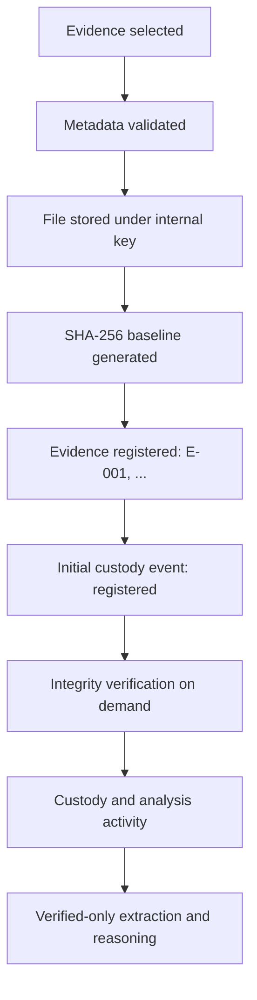

# Evidence, Integrity, and Custody

This document is the authoritative description of how Provena registers
evidence, proves its integrity, and tracks its custody. It covers the
implemented foundation and the verified-only analysis gate
(see `docs/ai-architecture.md`).

## Concepts (kept separate)

- **Evidence record:** describes the item (identifier, metadata, baseline
  digest, storage reference).
- **Integrity:** whether the stored bytes still match the baseline digest.
- **Chain of custody:** who held or handled the item and when.
- **Audit log:** which application actions users performed.

A custody transfer therefore creates two records: a custody event (the
forensic fact) and an audit event (the application action).

## Evidence lifecycle

Every stage shown is implemented.

## Registration and storage

- Uploads arrive as multipart form data (`POST /api/investigations/{id}/evidence`).
- The server streams bytes to a staging file while computing SHA-256 in chunks,
  so large files never load fully into memory. Empty files are rejected;
  files over `EVIDENCE_MAX_UPLOAD_BYTES` (default 100 MiB) are rejected with
  HTTP 413, and partial staging files are removed.
- Files are stored as `<storage-root>/<investigation-id>/<uuid>` with no
  extension. The original filename is metadata only and is never used for
  storage, which rules out path traversal and collisions by construction.
- Only `app/modules/evidence/storage.py` touches the evidence directory. The
  database holds the storage key; API responses never expose it.
- The staging file is promoted atomically after the database transaction
  commits. If the transaction fails, the staging file is deleted, so ordinary
  failed uploads leave no orphans. (A crash between commit and promotion would
  surface honestly as UNAVAILABLE on the next verification.)
- Storage root is configured with `EVIDENCE_STORAGE_ROOT`
  (`./evidence-storage` locally, `/evidence` volume in Docker Compose).
  Runtime uploads are git-ignored; synthetic demo files live in `sample-data/`.

## SHA-256 baseline

- The digest is computed from the actual bytes with Python's `hashlib.sha256`.
  SHA-256 is the integrity hash; MD5 and SHA-1 are never used.
- The baseline digest, uploader, registration timestamp, and file bytes are
  immutable: metadata endpoints cannot change them, and there is no
  replace-file operation. Corrections mean registering a new item.

## Verification

`POST /api/investigations/{id}/evidence/{eid}/verify` recomputes SHA-256 over
the stored bytes and compares it to the baseline:

| Result | Meaning |
| ------ | ------- |
| `verified` | Recomputed digest matches the baseline. |
| `mismatch` | Recomputed digest differs. The item is suspect; the baseline is kept. |
| `unavailable` | The stored object could not be read. |
| `not_verified` | Baseline exists but no verification has run yet. |

Every attempt persists an `evidence_verifications` row (expected digest,
observed digest, result, performer, timestamp) and updates the item's current
status. A mismatch is recorded, surfaced prominently, and never auto-repaired.
Verification writes an audit event (`EVIDENCE_VERIFIED`, or
`EVIDENCE_INTEGRITY_MISMATCH` for mismatches).

Initial hashing is not verification: only an explicit later recomputation
moves an item out of `not_verified`.

## Integrity gate for analysis

Automated analysis runs only on evidence whose current integrity status is
`verified`. This is enforced server-side when a run starts: every other
state becomes an explicit blocked run outcome (`blocked_not_verified`,
`blocked_mismatch`, `blocked_unavailable`) with a human-readable reason, and
the run still records what it skipped. If an item later degrades to
`mismatch` or `unavailable`, new runs against it are blocked while historical
results remain visible alongside the current state. The principle is simple:
Provena does not perform investigative analysis on bytes it has not verified
against the immutable ingestion baseline.

## Chain of custody

- `custody_events` is append-only. There are no update or delete endpoints.
- Registration automatically creates the first event (`registered`, holder set
  to the registering user).
- Transfers (`POST .../custody`) require an active target user who is a member
  of the investigation. The current holder is derived from the latest event,
  so history is the source of truth rather than a stored column that could
  drift.
- Actions: `registered`, `transferred`, `released_for_analysis`,
  `returned_to_custody`, `received`, `other`, each with optional notes.
- No signatures, PKI, blockchain, or legal certification is claimed.

## Timelines

- Each evidence item exposes a chronological timeline assembled from its
  registration, custody events, and verifications
  (`GET .../evidence/{eid}/timeline`).
- Each investigation exposes a timeline combining creation, status changes,
  evidence registrations, verifications, and custody transfers
  (`GET /api/investigations/{id}/timeline`), plus a custody overview
  (`GET /api/investigations/{id}/custody`). Both are deterministic assemblies
  of real records, not AI reconstruction.

## Permissions

| Capability | Admin | Investigator (manager) | Member analyst/custodian |
| ---------- | ----- | ---------------------- | ------------------------ |
| View evidence, verify, download | Yes | Yes | Yes (assigned only) |
| Register evidence, edit metadata | Yes | Yes (own/led work) | No |
| Record custody events | Yes | Yes | Custodians only |
| Archived investigation changes | Yes | No | No |

Managers are admins, creators, and lead investigators. All enforcement is
server-side; the UI only hides actions for convenience.

## AI readiness

Evidence records give the future AI layer stable identifiers (`E-001`),
provenance (source, acquisition time, original filename), types for routing
(`log`, `network`, ...), integrity state, custody history, and controlled
content access through the storage service. AI analysis should prefer
evidence whose integrity state is known, and a mismatch must stay visible to
that pipeline rather than being silently consumed.
